

	
 

# 产品简介

蜂鸟（HummingBird） 是Golang语言实现的超轻量级物联网开发平台，他的核心服务完全由团队自行研发，从这个平台设计之初，轻量级、性能优异当作我们的一条开发准则。所以它服务都是采用Golang语言编写，占用内存极低。在数据存储上，我们创新的使用了SQLite和LevelDB当作了我们存储数据库，得益于SQLite的轻量级和LevelDB对数据的高吞吐和高压缩的特点， 经过实际测试，在1C/1G 100G存储的物理机上，可实现数千设备的连接和8000W条的消息存储。

当然，如果您对数据有可靠行、海量存储等要求，您完全可以把SQLite和LevelDB换为MySQL和TDengine，蜂鸟物联网平台兼容多种数据库连接，用户可以根据自己的业务需要选择适合自己的数据库。

“麻雀（蜂鸟）虽小，五脏俱全” 虽然蜂鸟作为一个超轻量级物联网平台，但是他的核心功能并不会消减。设备接入、产品管理、物模型、告警中心、规则引擎...这些所有物联网平台的标配功能，都可以在本平台中找到。

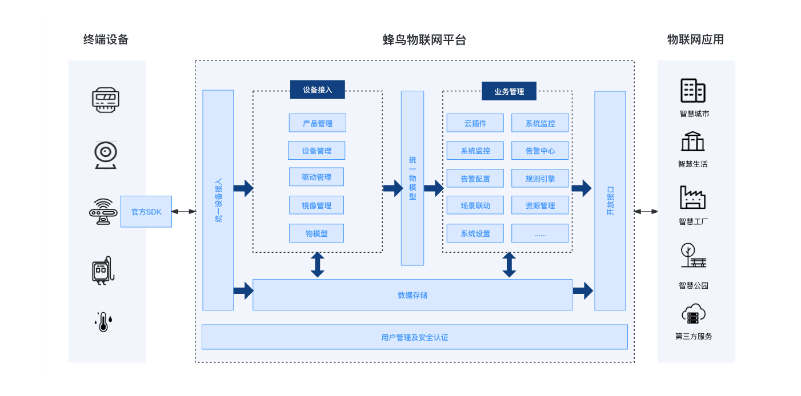

# 部分页面展示

| 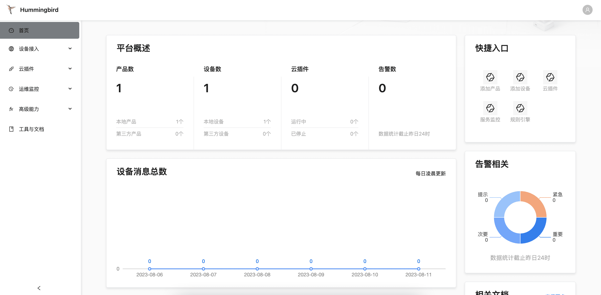 | 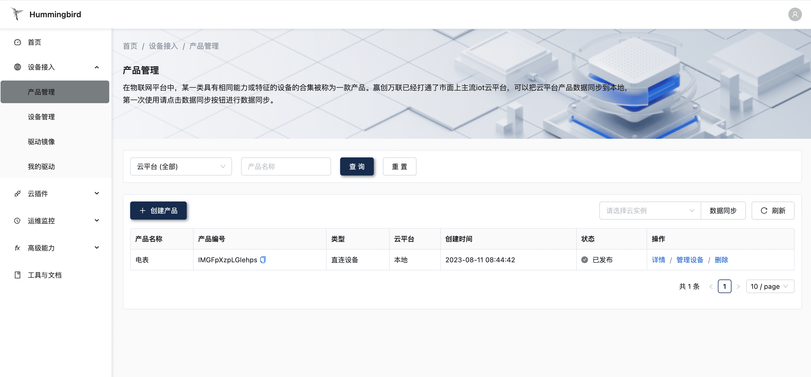  |
|:--------------------------|:---------------------------|
| 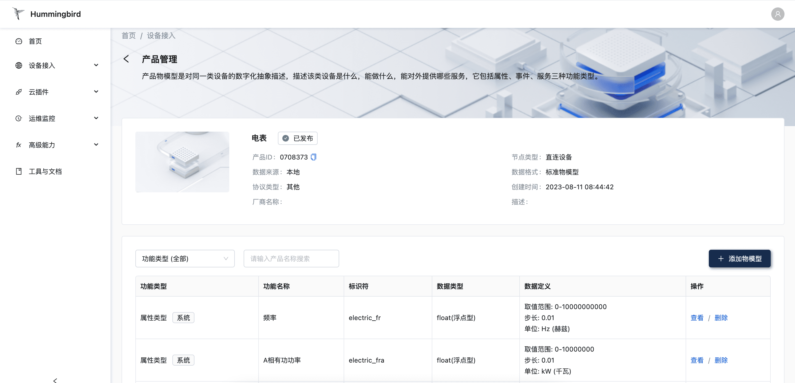 | 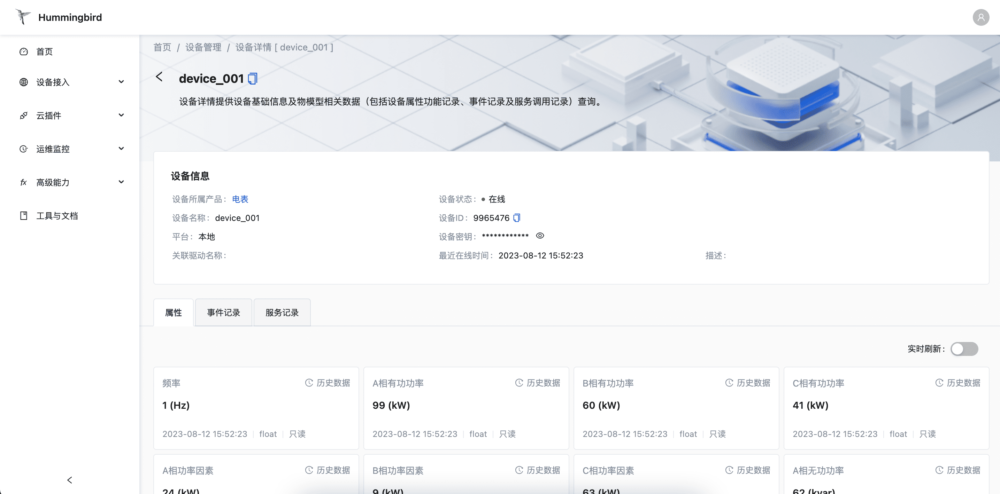  |
| 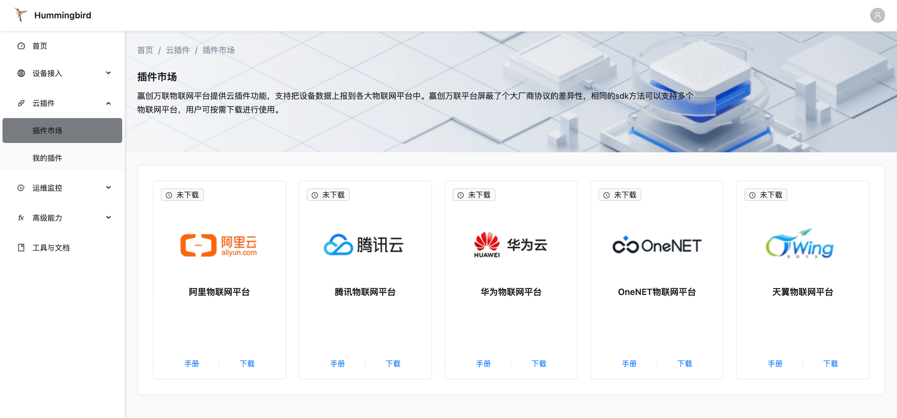 | 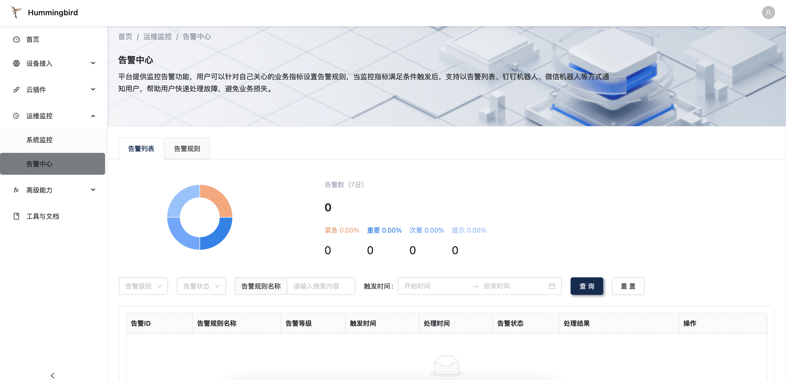  |
| 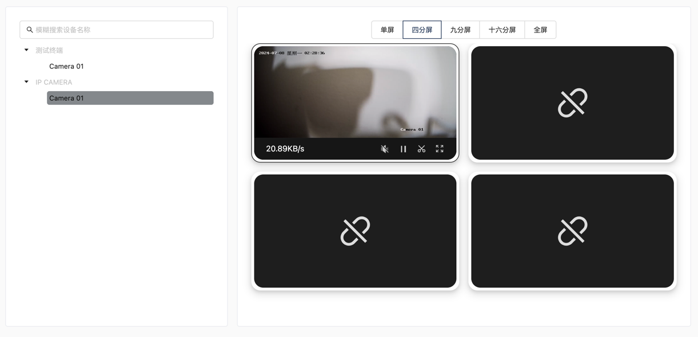 | 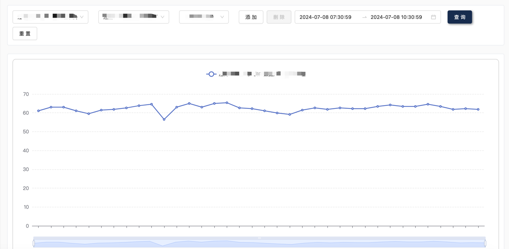 |
| 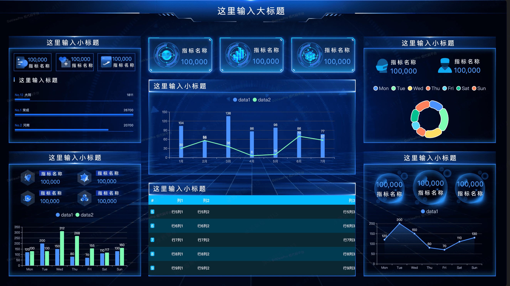 |   |

# 小程序页面展示

|  | 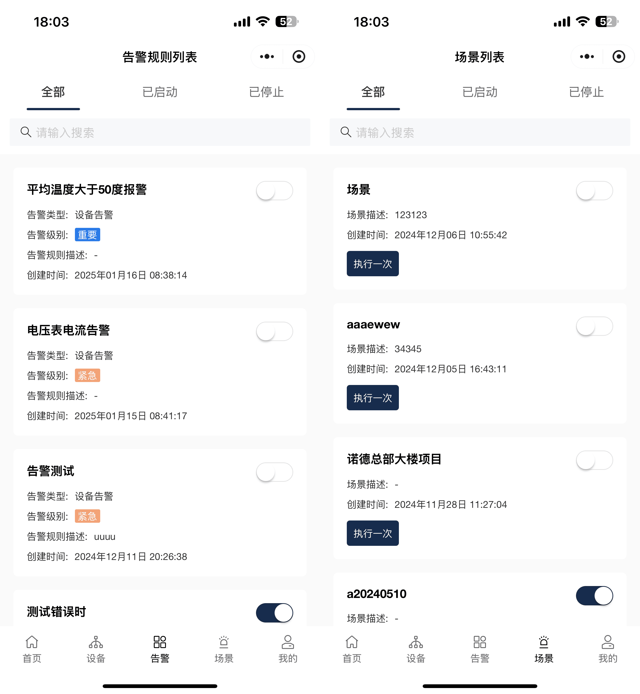 |
|:---------------------------------------|:---------------------------------------|
| 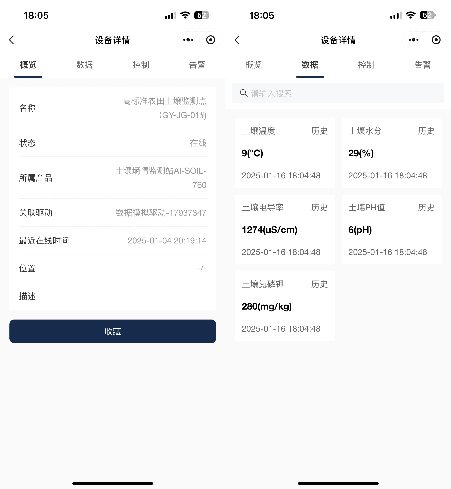 | 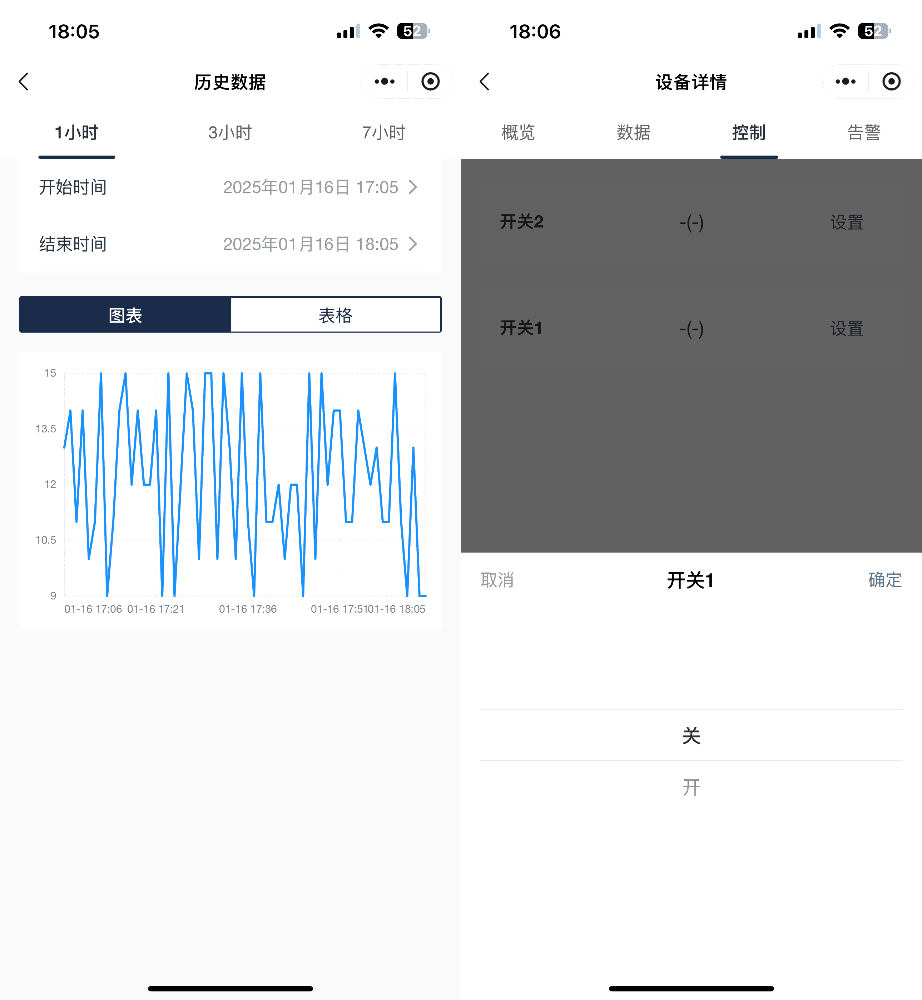 |

# 官方文档地址
https://doc.hummingbird.winc-link.com/

# 快速启动

git clone https://gitee.com/winc-link/hummingbird.git

cd hummingbird/manifest/docker 

docker-compose up -d

# 主要功能

- 产品管理
- 设备管理
- 镜像管理
- 驱动管理
- 驱动市场
- 系统监控
- 告警中心
- 资源管理
- 规则引擎
- 场景联动
- 插件市场
- 数据大屏

# 产品优势

- **免费开源**：我们源代码全部开源，可供个人学。
- **性能优异**：经过实际测试，在2C4G主机上，可支持60k的设备连接。模拟4k设备以1000ms的间隔向服务端发送16kb长度的属性数据，cpu使用率稳定在百分之60、内存使用率稳定在百分之16。
- **多数据支持**：平台支持SQLite、LevelDB和MySQL、TDengine数据库，用户可以根据自己的项目需要，选择适合自己的数据库。
- **支持可视化大屏**：用户只需要进行简单拖拽，无需写任何代码，即可完成可视化大屏开发设计。
- **内置产品模版库**： 平台内部预置产品模版（390条），帮助用户一键创建产品。
- **文档清晰**：平台文档清晰完整，文档内部有大量使用案例和视频教程，帮助用户快速理解产品和使用产品。
- **部署简单**：平台所有服务都是以docker形式运行，支持docker-compose命令一键启动。
- **成本优势**：在中小型物联网项目（设备数<=5000）中，只需要2C4G主机即可，并且还可以支持本地部署。

#  联系我们

我们开通了蜂鸟交流群，在使用在本品的过程中有任何问题，可以进群沟通。

| 微信群                (先加好友备注加群)                                                     | QQ群                                                                       |
|:------------------------------------------------------------------------|:--------------------------------------------------------------------------|
|  | 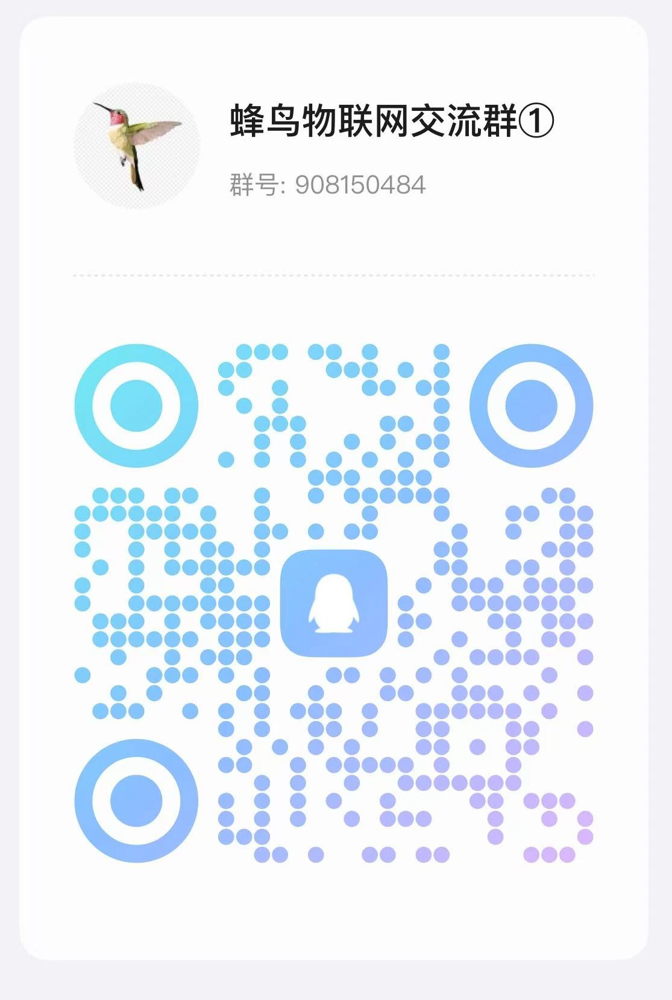 |

# 开源贡献

-   从 `master` 分支 `checkout` 一个新分支（**注**：请务必保证 `master` 代码是最新的）
-   新分支命名格式：`feature/username/description`，例如：`feature/pick/mqtt_driver`
-   在新分支上编辑文档、代码，并提交代码
-   提交 `PR` 合并到 `develop` 分支，等待作者合并即可

# 开源协议

`Hummingbird` 开源平台遵循 [Apache 2.0 协议](https://www.apache.org/licenses/LICENSE-2.0.html) 如果你想把蜂鸟物联网平台进行商用，请提前找作者授权！

## Stargazers over time

